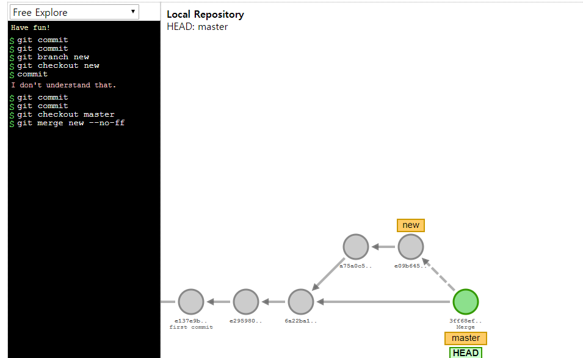
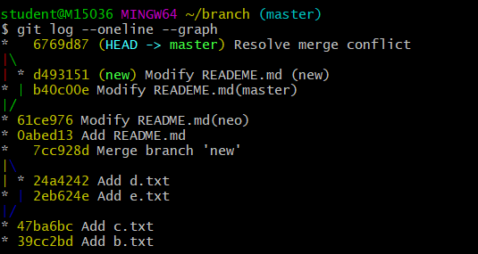

# 깃허브에 올라간 파일 가져오기/내보내기

> push_pull 파일 내 컴퓨터 2대 생성 (파일 교환하기)

- multicampus(컴퓨터1) : 내부에 Test 폴더 생성 

- house(컴퓨터2)


## 1. 원격저장소에 파일 올리기 

### 1.1 test폴더(가져올) 내 파일 생성하기 

> multicampus >  test 폴더 생성 후, 해당 test폴더로 이동

- `$ git init` : 들어와있는 폴더 기준으로 그 파일을  git파일로 생성

- `$ git status` : "commit 할 대상"이 있는지 상태 확인해준다 (commit 할 대상이 있으면 붉은 색 ). 

새로 생성 후 항상 상태 확인 && commit 대상이 없을 시 
`On branch masternothing to commit, working tree clean`


### 1.2 폴더 내 파일 a.txt 생성 

1) add : a.txt파일 생성 후 statging area에 넣는다 

2) commit -m : 뭘 했는지에 대한 내용을 적는다

> commit 된 저장 내역&& 상태확인   : 한 줄로 보기

- `$ git log`

- `$ git log --oneline`


### 1.3 git hub (원격저장소) 올리기

> `$ git push origin master`  깃헙(원격저장소)에 먼저 올려야 한다. 

##### 1) 깃허브 사이트에서 저장소 생성 :  test 프로젝트 폴더 명과 불일치 해도 된다 .

만들어진 원격저장소 주소를 따온다 https://github.com/zzomill/test_project.git


##### 2) git bash 에서 원격 저장소 주소지를 알려준다. 

> ` $ git remote add ` `$ git remote `

저장소 추가 : $ git remote add [[원격저장소 이름][]][[원격저장소 주소]]]

추가된 저장소 확인 : `$ git remote`  혹은 `$ git remote- v`(verbose) : 주소까지 다 나온다


##### 3) 원격저장소에 올리기

`$ git push [원격저장소 별명] master`


- 원격저장소 이름 변경 : 

`$ git remote rename` [현재저장소 명]<바꿀 저장소 명>

저장소 확인 : `$ git  remote v-`


## 2. 집컴퓨터로 가져오기 

### 2.1 집컴퓨터로 이동해서 외부파일 전체 내려받기

>  위치 : 내려받고자 하는 저장소 주소를 복사 후, house폴더 위치에서 bash 에서 명령 

- 최초 프로젝트 가져오기

  - `$ git clone`[copyed repository 주소] : 저장소에 있는 폴더를 그대로 가져옴(맨 처음 그 프로젝트를 가져올 때만 사용 )

    :집 컴퓨터 내 원격저장소와 같은 이름의 폴더 생성

  - 자동으로 원격 저장소의 주소가 저장 :  ~/push_pull/house/test_project (master)

  - **clone 시 [폴더명]_project가 붙는다.**

- house 폴더 내> 만들어진 `test_project` 에서 remote -v로 깃파일 대상인지 확인
  - 깃으로 관리되는 프로젝트는  경로 끝에 -master로 만들어진다
  - `$ git ls -a` : 깃으로 관리되는 폴더는 .git 폴더 안에 파일이 존재 
    - ./  ../  .git/  a.txt  b.txt


### 2.2 집컴퓨터에 새로운 파일 생성하여 원격 저장소에 올리기

##### 1. c.txt파일 생성 후 commit 하기 

- 깃메세지 ; 주어 작성 안 함, 제목은 명령조로 
  - git log 이후 `:` 으로 끝나면 `q`로 나온다
  - $ git commit `-m ` 작성 못했을 때  : esc` 3번 누르고 `:q`로 나온다 

- `$ git push origin master` : 원격 저장소에 다시 올린다. 


### 2.3 컴퓨터B에서 text 폴더 내 c.txt 추가 분 가져오기 

mulcam컴퓨터로 이동 > test 파일로 이동 

- 원격저장분과 하나의 차이분만 가져와야 함 

`$ git pull (push와 거울같은 명령어 )origin master` : 차이분만 가져온다. 


## 4. push - pull signal 루틴 

>  push - pull signal  

##### 멀캠 (컴퓨터1 / A) : 

1) 집에서 작업한 추가 분이 있는지 git pull로 원격저장소에만 저장되어있는 추가 분을 컴퓨터로 가져온다 

2) 컴퓨터 1에서 그날 작업한 분을 push 하여 깃허브에 올린다. 

##### 집 (컴퓨터2 / B) : 

1)  git pull 로 멀캠2)를 가져온다 

2) git push 로 원격저장소에 올린다. 


##### 협업 시 Synchronous 

: 동시 협업이 불가 하나의 작업이 끝나야만 협업이 가능

: 작업이 끝났는지 확인을 해야됨


### 4.2 선형구조 

여러사람이 같은 파일을 받아 다른 내용(같은 파일명)으로 commit 할 때 

> 첫번 째 commit 만 허용되고 두번째 commit은 불허(업데이트 거절 )

같은 이력이 아니면 혹은 추가된 내용이 각기 다르다면 (선택의 상황) 불허한다.

initial 

commit 

같은 파일을 다른 버전으로 

branch : 여러개의 사실을 받아들이는 형태


## 5. 주의사항 

>  **git 은 하나의 깃 프로젝트 폴더만 허용한다**

- A(최상위폴더) 에 자체적인 깃관리가 된다. == 최상단 A폴더에만 에 .git폴더가 존재하는 구조
  - git 으로 관리된 TIL 파일 내 다른 깃 프로젝트가 들어오면 git이 관리해야 할 대상을 판단하지 못한다. 


### 5.1 최상단 폴더 안에서 다시 init한 폴더가 생성된 경우 

> A폴더(최상위폴더)를 init하게 되면 그 안에 생기는 모든 폴더/ 파일들은 자동으로 git으로 관리하게 된다. 

A 안에 a폴더 생성 후 를 다시 init하게 되면 .. (새로운 git이 생성되면) 다른 깃이 a폴더를 관리를 하게 된다. 

##### [문제 -  a폴더 안에 a.txt를 생성한 경우]

관리대상이 2개가 된다. 관리 대상이 A깃 인지 a깃인지 어디인지 .. 모름

=> **하나의 깃 프로젝트 안에서는 다른 깃 프로젝트를 생성하면 안된다.**(불가능은 아니지만)


##### [a 폴더 내 .git 폴더를 지우고 싶을 때 ]

> a폴더 위치에서  .git이라는 폴더를 삭제한다.  `$ rm -r .git`

- 폴더삭제 : `$ rm -r` (리컬시브) [폴더명] : 폴더를 삭제할 때  


### 5.2 원격 repository 내 다른  git project B를 git A폴더로 옮기고 싶을 때  

함부로 옮기면 안됌

1) B 폴더를 A폴더로 옮기기 :  A, B 폴더가 존재하는 홈위치로 돌아가서 (B, A의 상위카테고리)

- 폴더 이동 : `$ mv`[이동할 파일]< 이동할 곳 >  (이동할 곳에 띄어쓰기 주의)

$ mv push_pull/ TIL

2) A폴더 내 B폴더로 위치에서 B의 .git 폴더를 지운다 

- 폴더 삭제 : `$ rm -r` .git


## 6. A, B 끝말잇기 연습

### 6.1 A :  파일 준비하기 

1. A :  ~에서 새로운 wordchain 폴더 생성 후  깃으로 init  대상 : .md 파일  

2. B : 깃 주소를 가져온다 https://github.com/dico1631/wordchain.git
3. ~ 위치에서 `$ git clone` [repository address] 
   - ~/wordchain (master) 생성된다
   - `$ git diff` 수정 내역 확인 가능

4. 끝말잇기 추가 후 push 하기 - A가 B에게 권한 부여 

   - 권한 부여 이전에, `$ git push origin master` : 에러메세지 

   - 개인의 repository는 clone은 가능하되, 권한이 주어지지 않으면 push 하지 못한다. (A가 파일 생성 origin master)

     remote: Permission to dico1631/wordchain.git denied to zzomill.
     fatal: unable to access 'https://github.com/dico1631/wordchain.git/': The requested URL returned error: 403

     - collaborator 등록 

       : settings > options > 상대방 id/이메일 주소 등록 (B> 이메일 수락 후 push 재시도)

       

### 6.2 B : 파일 `$ git pull origin master`

끝말잇기 단어 추가 후 

$ git add [파일명] -> $ git commit -m "추가내용" -> $ git push origin 


## 7. 프로젝트 이슈 

> 깃허브에서 이슈 작성하기 

예. 깃헙 tensor flow 

- 마크다운 문서로 작성 가능
- 작성자가 issue close될 수 있다. 


## 8. branch : 다른 사실대로 저장 가능

> 새로운 브랜치 생성

### 8.1 개념

- master : git이 생성되자마자 처음 나타나는 세계 (최초 가지)
- branching : 원래 있는 기능에서 추가 => 제 2분기 이후부터 master와 다른 형태로 운영이 가능
- 다른 세계처럼 꾸밀 수 있다.  
  - 앱이 돌아가는 상태에서 기능을 추가하려 할 때 (테스트 하려 할 때)

- git flow : 
  - 예. http://woowabros.github.io/experience/2017/10/30/baemin-mobile-git-branch-strategy.html
  - 상호명이 굉장히 가려져 있는 불편함

갖고있는 branch 확인 : `$ git banch`


### 8.2 명령어 

추가 : `$ git brandch` [새로운 세계 이름]

새로운 세계로 이동하기 : `$ git switch`[이동할 폴더 명]

추가하면서 이동하기 : `$ git switch -c`[새로 생성할 폴더 명]

~/branch (new) 로 경로 명이 바뀐다. 

47ba6bc (HEAD -> new, master) Add c.txt

HEAD : 어느 세계이 있는지 pointer역할 


### 8.3 brach 생성, auto-merge

```shell
# 1. branch 폴더 생성 
$ mkdir branch 
$ git init 

# 2. a,b,c 파일 생성 후 각 파일 add, commit 
# add과정으로 논리적인 구조로 순차적으로 추가할 수 있다 
$ touch [파일명]
$ git status # branch 내부에 있는 파일들 상태 확인 
$ git add [파일명]
$ git commit -m "추가할 메세지"
>> 결과적으로 c.txt까지 생성 후 브랜치를 만든다. 
$ git log --oneline #commit된 파일 리스트 확인

# 3. branch 폴더 내 branch 생성후 d.txt(new) e.txt(master) 두 개 파일 생성하기 
$ git branch #폴더 내 브랜치 확인
$ git branch new #새로운 new 브랜치 생성
$ git switch new #새로운 브랜치로 이동 # 경로 : ~/branch (new)
$ git log --oneline #새로운 브랜치에서 log 확인하면 master에서 만들어진 파일까지 모두 확인 가능 
47ba6bc (HEAD -> new, master) Add c.txt
39cc2bd Add b.txt

$ git touch d.txt #새로운 브랜치에서 d.txt파일 생성 
$ add, commmit

$ git switch master # master 브랜치로 이동한다
$ ls : a.txt  b.txt  c.txt 3개 파일만 확인
>> new branch에서 생성했던 d.txt 파일을 보이지 않는다. 분기 이후 master와 다른 방식으로 운영이 가능하다 
$ touch e.txt # master에서 새로운 파일을 만든다
$ add, commit # e.txt까지 commit
$ ls : a.txt  b.txt  c.txt e.txt 까지 파일이 등록된다 (new에서 단독으로 생성됐던 d파일 없음)

$ git switch new # 새로운 브랜치로 이동 
$ ls : a,b,c,d 파일까지만 보인다 

==============================================================

# 4. new와 master merge하기 : auto merge
$ git checkout master # merge가 일어날 master위치로 이동한다 
$ git merge new # merge할 브랜치 대상을 쓴다(여기서 new)
$ git log --oneline # 머지된 이후 master의 log 확인 
>> b-c-d-e 순서로 들어감 확인(a는 놓침)
7cc928d (HEAD -> master) Merge branch 'new'
2eb624e Add e.txt
24a4242 (new) Add d.txt
47ba6bc Add c.txt
39cc2bd Add b.txt

$ git log --oneline --graph : 그래프 형식으로 확인 가능 
사진 

$ ls : a.txt  b.txt  c.txt  d.txt  e.txt
>> merge된 master브랜치에서 a~e까지 파일 리스트 확인된다. 
```


## 9. merge

> master, new branch merge (git 에게 branch 우선순위는 없다)

### 9.1 auto merge

> 깃은 대부분의 경우 자동 병합. merge 시점에 양 쪽 브랜치에 commit들이 쌓여있지만 Conflict가 발생하지 않는 경우. 

##### 명령어

- 프롬프트 위치 확인
  - `$ git branch`  : 현재 폴더 안에 있는 브랜치 리스트 확인 가능 
  - `$ git log`에서 HEAD가 가리키는 위치 

- 브랜치 이동 
  -  `$ git chechout` : 과거 깃을 볼 떄 명령어와 일치해서 비추(비주얼 브랜치에서는 사용)
  - ``$ git switch`

- 브랜치 merge 

  : 병합 할 위치로 이동 (여기서 master) 후에 머지한다. 

  - `$ git merge`[병합할 브랜치 이름]
  - 화면전환 이후 >  `esc`  +  `:wq`  (write quit : 쓰고 나오기)

- 브랜치 머지  확인
  - `$ git log --oneline --graph` : 그래프 형태로 확인 가능 


### 9.2 fast-forward merge 

> 브랜치 분기가 일어났지만, merge 시점에서 branch 한 쪽에서만 commit이 쌓여있는 경우 

ex. new에만 commit이 존재, master에서 없었을 때 


깃비주얼라이저 이용

##### 명령어

- 브랜치 삭제 : `$ git branch -d`[삭제할 브랜치 명]

- merge하면서 다른 브랜치에서 작업한 것을 알릴 때 `$ git merge new --no-ff `




##### fast-forward merge 

```shell
# 0. automerge 됐던 new 브랜치를 삭제하고 시작한다
$ git branch -d new
> Deleted branch new (was 24a4242).

$ git branch # new 브랜치 삭제하여 master만 남긴다. 
> * master

# 1. branch 폴더 내 README.md 파일 생성 후 commit까지 완료한다.  
$ git status # README.md 올릴지 확인(붉은글씨)
$ git add , commit # README.md 을 commit 한다. 
$ git log --oneline 
>> a~README.md 파일까지 commit된 것 확인 가능 
0abed13 (HEAD -> master) Add README.md
7cc928d Merge branch 'new'
2eb624e Add e.txt
24a4242 Add d.txt
47ba6bc Add c.txt
39cc2bd Add b.txt

# 2. 신규 branch neo 생성
$ git branch neo
$ git switch neo #neo 브랜치로 이동

# 추가작업 2-2.README.md에서 내용만!! 수정한다. 

$ git status # neo 브랜치에서 commit할 대상 상태 확인 
>>
On branch neo
Changes not staged for commit:
  (use "git add <file>..." to update what will be committed)
  (use "git restore <file>..." to discard changes in working directory)
        modified:   README.md

no changes added to commit (use "git add" and/or "git commit -a")

$ git add, commit # neo 브랜치에서 수정된 README.md 파일 commit 완료
$ git switch master # 합병하기 위해 master 브랜치로 다시 이동한다. 
$ git merge neo
>Fast-forward 내용 확인 가능
Updating 0abed13..61ce976
Fast-forward
 README.md | 3 +--
 1 file changed, 1 insertion(+), 2 deletions(-)

$ git branch # merge 이후 master에서 브랜치 리스트 확인(neo가 머지됐지만 여전히 남아있다)
>
* master
  neo
$ git branch -d neo # 머지된 브랜치는 삭제하는게 좋다. 
$ git branch # master만 남아있는지 다시 확인 

```


### 9.3 Resoleve merge conflict 

> merge conflict 발생. merge 시점에서 branch 한 쪽에서만 commit이 쌓여있고 컨플릭트 발생

- 동일 파일 내 내용이 상충하는 경우 

```shell
# 1. 
$ git switch -c new
# README.md 파일 신규 생성, 내용작성 
$ git add, commit # 파일을 new 브랜치에 올린다

# 2. 
# 1. 에서 작성한 README.md 파일 내용만 수정하여 커밋한다 
$ git switch master
$ git status # commit되지 않은 수정된 README.md 확인(붉은글씨)
$ git add, commit # master에서 동일 파일을 내용만 바꿔서 commit한다
$ git commit -m "Modify READEME.md(master)"
> master에서 파일 확인 시 최종 수정된 내용이 반영된다
> new 브랜치 위치에서 파일 확인 시 수정 이전의 내용이 확인된다. : 9.2 fast-forward 발생 

# 3. 충돌상황 : master에서 수정된 파일, new 에서 만들어진 파일 => 각 동일 파일 존재할 때 merge하는 상황
$ git merge new # master 브랜치위치에서 new를 머지
Auto-merging README.md
CONFLICT (content): Merge conflict in README.md
Automatic merge failed; fix conflicts and then commit the result.

> 경로 상태 중간단계에서 멈춘 상태 : ~/branch (master|MERGING)
$ git status # 상태 확인
On branch master
You have unmerged paths.
  (fix conflicts and run "git commit")
  (use "git merge --abort" to abort the merge)

Unmerged paths:
  (use "git add <file>..." to mark resolution)
        both modified:   README.md

no changes added to commit (use "git add" and/or "git commit -a")

# 4. 충돌 resolve하기 
> README.md 파일 확인 시, 선택을 요청하는 텍스트가 보여진다
> 최종적으로 남길 텍스트 선택 후 나머지 삭제, 파일 저장

$ git add README.md # 파일 저장 후 다시 add, commit 한다 
$ git commit -m "Resolve merge conflict" # resolved된 머지 확실히 명시 

$ git log --oneline  # master 브랜치에서 commit 된 리스트 확인 
6769d87 (HEAD -> master) Resolve merge conflict
b40c00e Modify READEME.md(master)
d493151 (new) Modify READEME.md (new)
61ce976 Modify README.md(neo)
0abed13 Add README.md
7cc928d Merge branch 'new'
2eb624e Add e.txt
24a4242 Add d.txt
47ba6bc Add c.txt
39cc2bd Add b.txt

$ git log --oneline --graph
> 이미지
# 5. 최종 branch 폴더 깃허브에 올리기 
# 깃허브 repository : branch 이름 지정 후 url 따옴
$ git remote add origin https://github.com/zzomill/branch.git
$ git push origin master

```

##### 명령어 

- 브랜치 이동하면서 신규 branch 만들기 
  - `$ git swich -c new`

여기서 

-  master 브랜치에서 재작업해서 

=> new에서 볼때랑 master에서 볼 때랑 다른 파일로 나온다 


##### 4. 충돌 resolve하기 

이후 merge 해 보면 > 어떻게 처리할 지 물어봄 


메모장에서옮겨서 보면


<<<<< >>>> : merge conflict 표시 

==== :  구분선

15036 MINGW64 ~/branch (master|MERGING) 

: commit 에 중간단계에 있다. 는 표시 




- 파란선 : 다른 브랜치로 갔던 흔적


##### 정리) 결과

- 동시에 작업이 들어가도 동일 파일이 건들여지지 않는다 

- 협업 시 , 최대한 충돌이 안나는게 중요하다

- 양쪽 브랜치에 둘 다 커밋이 있는지 확인
  - 한가지에 있으면 fast forward merge : 9-2
  - 양쪽 커밋들 쌓여 있는데 내용이 상충하는 commit 이 있다면 상충하는 커밋 : 9-3

- 양쪽 커밋들 쌓여 있는데 내용이 상충하지 않으면 자동 머지 : 9-1


## 10. push되는 브랜치 변경하기

> $ git push origin master -> $ git push origin test


- 변경하고자 하는 브랜치 생성 후,  이동해서 그대로 push 한다 

- 로컬에서 했던 브랜치를 깃헙에서 리모트 할 수 있다. 


```shell
# 1. master 브랜치 위치에서 신규 브랜치(test), 신규파일 생성
$ git switch -c test
$ touch f.txt
$ git status # 확인 후 
$ git add, commit


# 2. test 브랜치 위치에서 push한다
$ git push origin test
>> 깃허브에서 commit 리스트에 branch : master/test 로 구분하여 확인 가능 

# 3. 깃허브에서 master, test 브랜치 머지하기 
>> 깃허브에서 브랜치 머지할 지 여부 확인 가능 

# 4. 깃허브에서 머지된완료 이후 로컬은 한 커밋 전 상태 
$ git pull origin master # 변화된 commit들을 로컬로 가져온다 
remote: Enumerating objects: 1, done.
remote: Counting objects: 100% (1/1), done.
remote: Total 1 (delta 0), reused 0 (delta 0), pack-reused 0
Unpacking objects: 100% (1/1), done.
From https://github.com/zzomill/branch
 * branch            master     -> FETCH_HEAD
   6769d87..fc5df4d  master     -> origin/master
Updating 6769d87..fc5df4d
Fast-forward
 f.txt | 0
 1 file changed, 0 insertions(+), 0 deletions(-)
 create mode 100644 f.txt

$ git log --oneline # master 브랜치에 존재하는 commit 완료된 파일리스트 확인 가능 
fc5df4d (HEAD -> master, origin/master) Merge pull request #1 from zzomill/test
b8dd6c3 (origin/test, test) Add f.txt
6769d87 Resolve merge conflict
b40c00e Modify READEME.md(master)
d493151 (new) Modify READEME.md (new)
61ce976 Modify README.md(neo)
0abed13 Add README.md
7cc928d Merge branch 'new'
2eb624e Add e.txt
24a4242 Add d.txt
47ba6bc Add c.txt
39cc2bd Add b.txt


```


##### 정리 ) merge 방법 

- 로컬에서 머지해서 다시 보기 (혹은)
- 깃헙에서 해보기 : compare and > merge 가능 여부 확인 가능 > create merge request
  - 요청서 작성 후 버튼 > 해당하는 repository에 코드 요청을 한 기록이 쌓임 : pull request tap에서 요청을 수락
  - 코드 재 확인하면 f.txt 파일 확인 가능 

- 로컬이 한 커밋 뒤에 있다.  : 로컬에서 마스터에서 병합물 가져오기 


cf. cat ~/.bash_history  : 작업했던 명령어 리스트 출력

